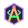

<!-- Waving Header (Dark to Light Green) -->

<!-- Typing Effect -->

 

  
  &nbsp;&nbsp;
  
  &nbsp;&nbsp;
  

----------------------------------

<h2 align="center">
  
  &nbsp;The Architect Behind the Code
</h2>

<table width="100%">
<tr>
<td colspan="2">
<h3 align="center">
  
  &nbsp;Core Identity
</h3>
</td>
</tr>
<tr>
<td width="300" valign="top" align="center"><kbd>Name</kbd></td>
<td width="500" valign="top"><b>Piyush Yenorkar</b></td>
</tr>
<tr>
<td valign="top" align="center"><kbd>Education</kbd></td>
<td valign="top">3rd Year Computer Engineering</td>
</tr>
<tr>
<td valign="top" align="center"><kbd>College</kbd></td>
<td valign="top">Saraswati College of Engineering</td>
</tr>
<tr>
<td valign="top" align="center"><kbd>Location</kbd></td>
<td valign="top">Navi Mumbai, India 🇮🇳</td>
</tr>
<tr>
<td valign="top" align="center"><kbd>Focus</kbd></td>
<td valign="top">Full-Stack, Machine Learning &amp; AI Developer</td>
</tr>
</table>

---

 

<h2 align="center">⚙️ My Tech Arsenal</h2>
<h3 align="center"> Full Stack Development</h3>

<table width="100%" style="border: none; background-color: transparent;">
<tr style="border: none;">
<td width="50%" valign="top" align="center" style="border: none;">
<b> Frontend &amp; Web</b>  

</td>
<td width="50%" valign="top" align="center" style="border: none;">
<b> Backend &amp; Data</b>  

</td>
</tr>
</table>

 

<b> AI &amp; Machine Learning</b>  
 

---

 

### 🚀 *Featured Projects*

<table align="center" style="border: none; background-color: transparent;">
  <tr style="border: none;">
    <td align="center" valign="top" width="50%" style="border: none;">
      <h3>🪐 PLUTO</h3>
      
<i>An AI-powered campus platform connecting students to opportunities, teams, and events at scale. Built with Team STARCY.</i>

      
      
    </td>
    <td align="center" valign="top" width="50%" style="border: none;">
      <h3>🎨 Canvas & Code</h3>
      
<i>Blending my passion for art and technology. A showcase of my award-winning sketches and digital designs.</i>

      
      
    </td>
  </tr>
</table>

 

---

 

### 📈 *GitHub Analytics*

<table width="100%" style="border: none; background-color: transparent;">
  <tr style="border: none;">
    <td width="50%" align="center" style="border: none;">
      
    </td>
    <td width="50%" align="center" style="border: none;">
      
    </td>
  </tr>
</table>

 

 

<!-- Temporarily hidden: The official github-profile-trophy server is currently down due to traffic limits. 

-->

 

---

 

### 🌱 *Current Focus*

 

<!-- Waving Footer (Light to Dark Green) -->

