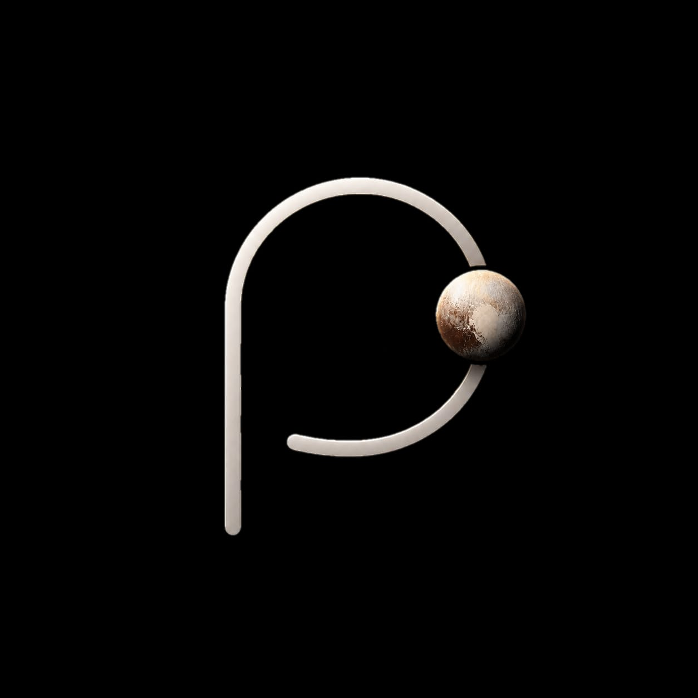
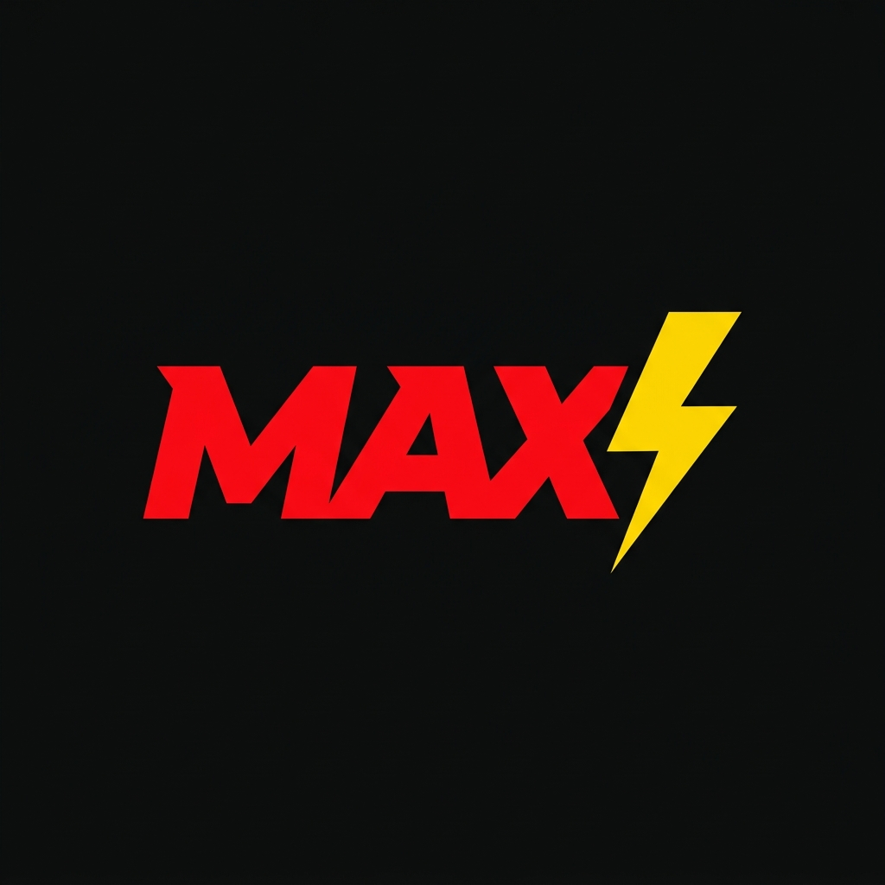
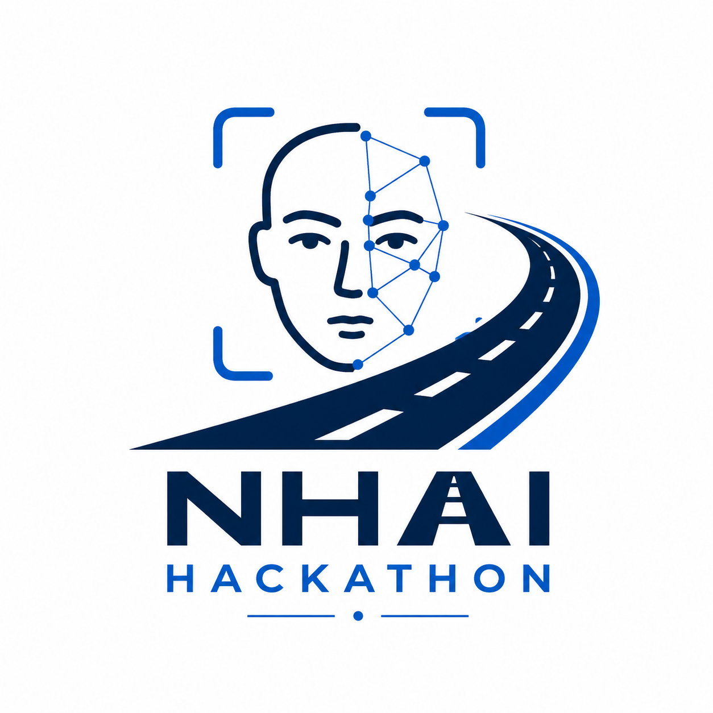

<!-- Waving Header (Dark to Light Green) -->

<!-- Typing Effect -->

 

  
  &nbsp;&nbsp;
  
  &nbsp;&nbsp;
  

----------------------------------

<h2 align="center">
  
  &nbsp;The Architect Behind the Code
</h2>

<table width="100%">
<tr>
<td colspan="2">
<h3 align="center">
  
  &nbsp;Core Identity
</h3>
</td>
</tr>
<tr>
<td width="300" valign="top" align="center"><kbd>Name</kbd></td>
<td width="500" valign="top"><b>Piyush Yenorkar</b></td>
</tr>
<tr>
<td valign="top" align="center"><kbd>Education</kbd></td>
<td valign="top">3rd Year Computer Engineering</td>
</tr>
<tr>
<td valign="top" align="center"><kbd>College</kbd></td>
<td valign="top">Saraswati College of Engineering</td>
</tr>
<tr>
<td valign="top" align="center"><kbd>Location</kbd></td>
<td valign="top">Navi Mumbai, India 🇮🇳</td>
</tr>
<tr>
<td valign="top" align="center"><kbd>Focus</kbd></td>
<td valign="top">Full-Stack, Machine Learning &amp; AI Developer</td>
</tr>
</table>

---

 

<h2 align="center">⚙️ My Tech Arsenal</h2>
<h3 align="center"> Full Stack Development</h3>

<table width="100%" style="border: none; background-color: transparent;">
<tr style="border: none;">
<td width="50%" valign="top" align="center" style="border: none;">
<b> Frontend &amp; Web</b>  

</td>
<td width="50%" valign="top" align="center" style="border: none;">
<b> Backend &amp; Data</b>  

</td>
</tr>
</table>

 

<b> AI &amp; Machine Learning</b>  

 

 

<b> App Development</b>  

 

---

 

<h2 align="center"> Featured Projects</h2>

<table width="750" align="center">
  <tr>
    <td valign="top" align="center">
      

        
        <h2> Pluto Campus</h2>
        <b>AI-DRIVEN CAMPUS INNOVATION PLATFORM</b>  
        AI-driven campus innovation platform. Centralizes event discovery, peer collaboration, and portfolio building.  
        
        
        
        
          
        
        &nbsp;
        
      

    </td>
  </tr>
</table>
<table width="750" align="center">
  <tr>
    <td valign="top" align="center">
      

        
        <h2> MAX</h2>
        <b>VOICE-CONTROLLED AI FOR DESKTOP AUTOMATION</b>  
        A lightning-fast desktop assistant that translates natural language into 80+ PC actions. It seamlessly automates your daily workflows natively on your machine.  
        
        
        
        
          
        
      

    </td>
  </tr>
</table>
<table width="750" align="center">
  <tr>
    <td valign="top" align="center">
      

        
        <h2> FlowMind</h2>
        <b>AI PROJECT MANAGER</b>  
        FlowMind is an AI project manager that learns your team and predicts failures before they happen.  
        
        
        
          
        
        &nbsp;
        
      

    </td>
  </tr>
</table>
<table width="750" align="center">
  <tr>
    <td valign="top" align="center">
      

        
        <h2> SafeShell</h2>
        <b>SECURITY &amp; EMERGENCY RESPONSE SYSTEM FOR WOMEN</b>  
        A smart safety platform providing real-time support, risk detection, and instant connectivity for personal security.  
        
        
        
        
        
          
        
        &nbsp;
        
        &nbsp;
        
      

    </td>
  </tr>
</table>
<table width="750" align="center">
  <tr>
    <td valign="top" align="center">
      

        
        <h2> NHAIFaceID SDK</h2>
        <b>OFFLINE FACIAL RECOGNITION &amp; LIVENESS DETECTION SDK FOR NHAI DATALAKE 3.0</b>  
        An offline facial recognition &amp; liveness detection SDK for NHAI field personnel, authenticating identities in zero-network zones in under 400ms on any mid-range Android device.  
        
        
        
          
        
        &nbsp;
        
        &nbsp;
        
      

    </td>
  </tr>
</table>

 

---

 

<h2 align="center"> GitHub Analytics</h2>

<table width="100%" style="border: none; background-color: transparent;">
  <tr style="border: none;">
    <td width="50%" align="center" style="border: none;">
      
    </td>
    <td width="50%" align="center" style="border: none;">
      
    </td>
  </tr>
</table>

 

 

<!-- Temporarily hidden: The official github-profile-trophy server is currently down due to traffic limits. 

-->

 

---

 

### 🌱 *Current Focus*

 

<!-- Waving Footer (Light to Dark Green) -->

